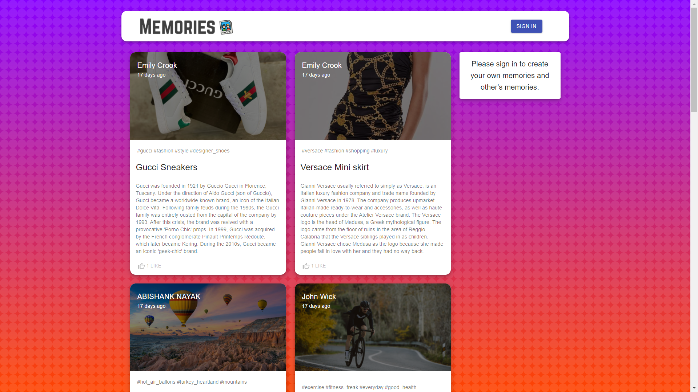
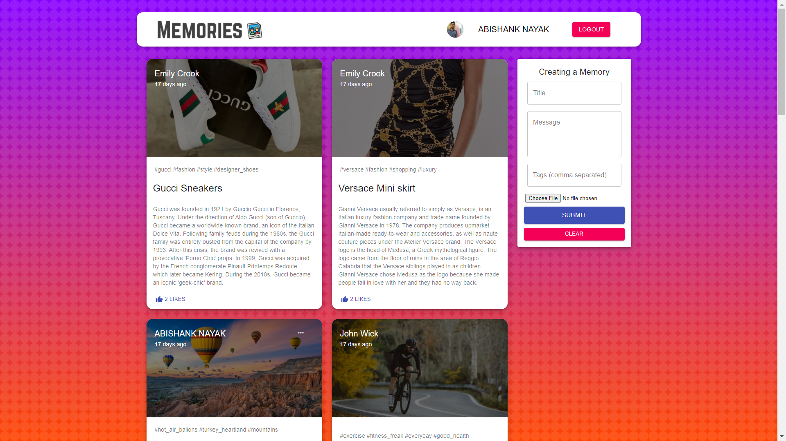
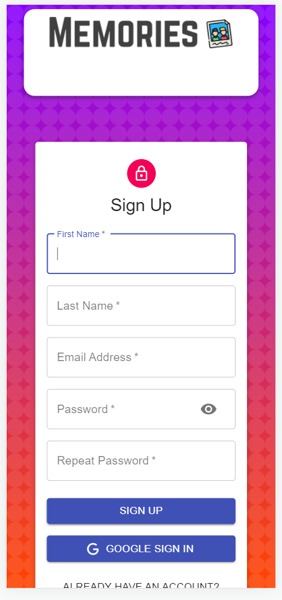
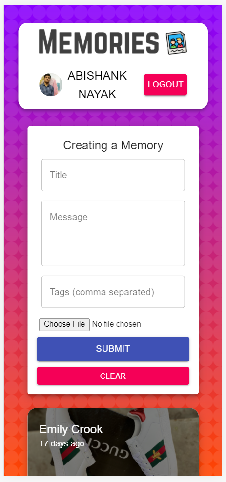

# MEMORIES MERN PROJECT
Using React, Node.js, Express & MongoDB I have build a Full Stack MERN Application. The App is called "Memories" and it is a simple social media app that allows users to post interesting events that happened in their lives.

You sign in using Google Oauth or Signup to a new account. You can like other posts, update or delete your own posts.

And it is fully Mobile Responsibe.

## Screenshots

## Run The Project

Setup:

run npm i && npm start for both client and server side to start the app

